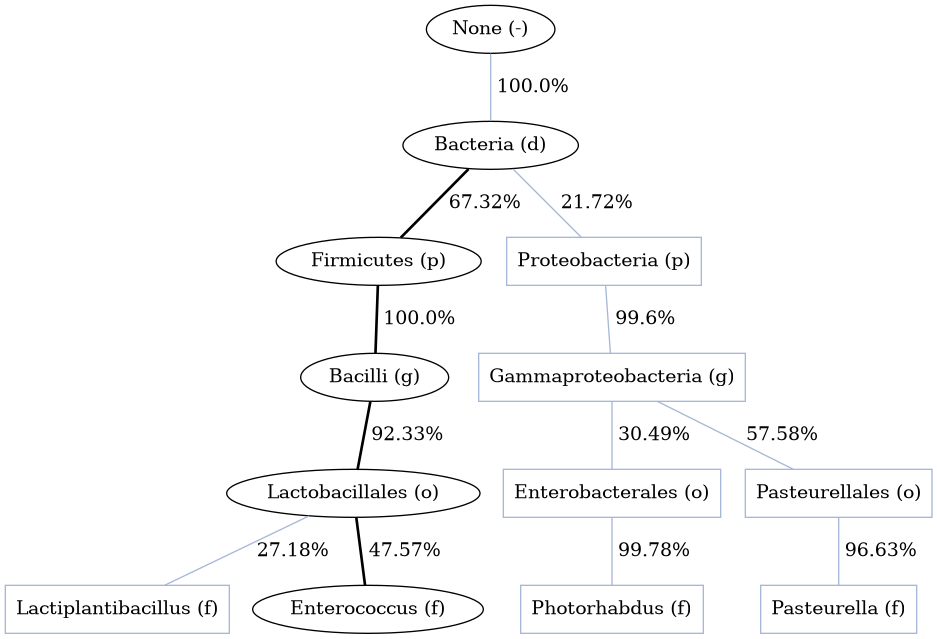
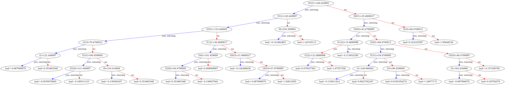
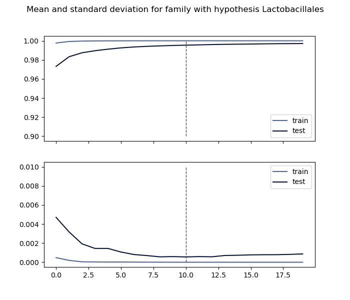
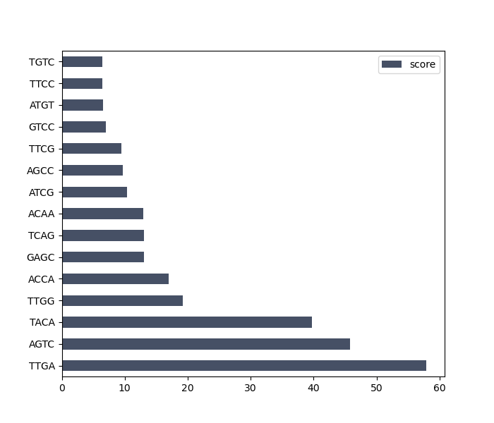
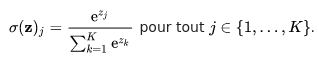

# Introduction

L'objectif de ce travail est d'avancer sur des questions de détermination d'un niveau taxonomique donné, sur base de données génomiques acquises par séquenceur, de petite taille et à faible coût, Oxford Nanopore[ref] ; ce en amont d'un programme capable de distinguer des souches entre elles par une approche de comparaisons de qgrams, afin de limiter le nombre de génomes à charger par ce programme et donc réduire son temps d'exécution.
Basé lui aussi sur des données d'Oxford Nanopore, ce programme se nomme ORI (Oxford nanopore Reads Identification), et a été développé par G. Siekaniec lors de sa thèse, *Identification of strains of a bacterial species from long reads*[ref].
La méthode de séquencage utilisée présente plusieurs caractéristiques notables, qui vont impacter notre traitement de la donnée :

+ On travaille sur des reads longs, atteignant les 10.000 pb.
+ Le taux d'erreur est plus élevé que sur un séquenceur classique (de l'ordre de 5 à 6% sur un génome au global)
+ Ces erreurs se présentent comme des IN/DELS et substitutions.
+ Le taux d'erreur des zones mononucléotidiques s'élève à 30%, le séquenceur n'ayant pas un flux constant et peinant donc à distinguer les fins de chaque base.

Dans ce contexte, notre approche ne se peut d'être celle d'alignements sur des génomes ; de par le taux d'erreurs, comme de par la largeur des bases de données à considérer ici. Notre approche va vraisemblablement plus être dérivée de la phénétique. La phénétique désigne la sous-discipline de la systématique qui, par l'étude de relations de (dis)similarité, tente de répondre à la problématique de classification du vivant, en utilisant des outils informatiques afin de pouvoir mener des analyses sans alignement contre des références.

L'intégralité du code de l'outil développé durant ce stage est disponible sur GitHub : https://github.com/Tharos-ux/wisp

# Etat de l'art

En biologie, la similarité entre séquences est interpétée comme une évidence d'homologie[ref] par le partage d'un ancètre commun. Si le concept du meilleur alignement est valide dans le cas d'une conservation honorable du génome, grâce à des matrices de substitution et des alignements locaux, les bactéries s'avèrent souvent affectées par des recombinaisons et/ou réarrangements ; et les échanges latéraux ne sont pas représentables sous forme d'arbres.

Ainsi, au cours de la dernière décennie, ont été pensées des approches sans alignement[ref] ; ce sont des techniques pouvant se baser sur une grammaire, sur de l'heuristique pure, une recherche de patterns... l'idée étant de donner des systèmes de contrainte à un algorithme d'apprentissage automatique afin qu'il puisse 

## Séquençage et enjeux

+ Faible taux de bactéries cultivé : quels modèles choisir pour chaque famille ?
+ Méthodes sur les reads courts avec faible taux d'erreurs
+ ORI, permet d'identifier une souche mais demande une pré-purgation des génomes

## Identificateurs existants

### CVTree
### LAF

# Matériel et méthodes

## XGBoost (eXtreme Gradient Boosting)

XGBoost est un algorithme se basant sur des arbres de régression présentant de hautes performances sur des données hétérogènes.
Un arbre de régression, à l'inverse d'un arbre binaire, dispose d'un score continu attaché à chaque feuille, et non discret.
Le modèle utilise des fonctions en tant que paramètres : à chaque itération, on sélectionne la fonction qui améliore le mieux notre modèle au regard d'un score q mesurant la qualité de la structure de l'arbre.

Lorsque l'on travaille sur de grandes quantités de datas, il n'est pas possible d'énumérer toutes les structures Q d'arbre possible. Par exemple, dans l'une des premières implémentations, le jeu de données se constituait de comptages de 5-mers, soit donc un total de 1024 attributs. Si on souhaitait exploiter toutes les features dans un système binaire, cela reviendrait à attribuer à chaque noeud pour tout chemin C une des features, et que C passe par tous les attributs une fois.
Cela donnerait, pour un seul arbre possible, un arbre présentant une profondeur de 1024 couches, soit 2¹⁰²⁴ sorties, pour un total de  n!/[(n+1)(2n parmi n)] arbres possibles, pour 2¹⁰²⁴ * n!/[(n+1)(2n parmi n)] chemins C distincts possibles à travers toutes les propositions d'arbres.

Or, XGBoost présente une complexité tendant vers O(n) en calcul avec n étant le nombre d'entrées de la data, et tendant O(n) en mémoire avec n étant le nombre de valeurs d'attributs pour tous les enregistements dans le chunk actif. Cela est dû au fait que XGBoost va subsampler le nombre d'attributs, et va en inférer une partie potentiellement différente à chaque nouveau boosting (cette différence étant liée au nombre d'attributs considérés à chaque split)

## Planification et tests préliminaires

Il m'a été donné de commencer par implémenter une version très naïve de XGBoost[source], afin de me familliariser avec le package. Au cours des premiers jours du stage, j'ai développé le noyau d'une application python, me concentrant en priorité sur les éléments qui ne seraient pas amenés à changer : formatage des fichiers LIBSVM[source], chargement et enregistrement de modèles. Ceci avait pour but de permettre d'avoir un ensemble de fonctions d'interface I/O de signature simple et échelonables aux différents niveaux de classification qu'il me serait donné d'implémenter par la suite.
L'implémentation de XGBoost a été réalisée en *approximate local*, pour plusieurs raisons[source] :

+ L'option *approximate* permet de découper la data en blocs au moment du traitement, et est donc moins demandeuse en ressources RAM
+ Cette même option rend une parallélisation possible, sur plusieurs machines
+ On a un support du subsampling de colonne, qui est particulièrement utile pour les approches multi-classes, et qui permet à chaque itération du boosting de ne pas utiliser toutes les features à la fois (et donc limiter la profondeur de l'arbre) tout en ne sélectionnant pas qu'une infime portion de ces features
+ L'option *local* forme des arbres profonds en re-calculant à chaque noeud l'intégralité de la suite de l'arbre, ce qui réduit la dépendance au nombre d'attributs global (ce qui s'avère utile dans le cas d'une fonction de seuil stringente)

Afin de mieux saisir la spécificité de la donnée et d'obtenir un candidat de split pour les classes, j'ai téléchargé un ensemble de génomes de l'ordre des *Lactobacillales* (34 génomes) ainsi que quelques extra-groupes (4 génomes) issus plus largement des *Firmicutes*, depuis la GenBank de la NCBI afin d'aprouver la validité du modèle de pensée suivi. En sélectionnant aléatoirement quatre génomes parmi cet ensemble et en traçant le graphe quantifiant la présence de chaque kmer, on retrouve bien une notion de "signature" pour chacun de ces génomes : des tendances se dégagent, proportionnellement à la taille du génome, quant à la prévalence de certains kmers.

Dans cette première version, pour un niveau de classification donné, on a :

+ **Classes** : taxons d'arrivée, cibles des prédictions et sources du jeu d'entraînement
+ **Attributs** : kmers (avec k fixé par l'utilisateur) encodés selon (respectivement) A, T, C, G en 0, 3, 1, 2[source].

Les jeux de données et de test se constituaient de séquences générées aléatoirement, et dont des dérivations en composition allant de 1 à 5% de la séquence initiale étaient calculées en de multiples exemplaires (n = 50). L'objetif était de tester l'immplémentation de XGBoost et de montrer que sur des séquences issues de génomes de synthèse, il était possible de distinguer l'origine de celui-ci à base de simples kmers. L'intuition à la base de ce rapprochement est que deux organismes d'une même espèce présentent quelques SNP et quelques variations de séquence liées par exemple à des versions ou des plasmides, mais que la composition globale des zones non accessoires, majoritaires dans les génome bactérien[source] restent la même ; et qu'à ce titre si ces populations simulées aléatoirement étaient distinguées avec une bonne confiance, on peut considérer cette méthode de division comme une candidate potentielle vis-à-vis de notre problème.

[figure]

## Philosophie de WISP

### Diviser pour mieux régner

Une des premières idées est d'adopter une approche *divide-and-conquer* ; à chaque niveau n de classification, on expurge du modèle suivant toutes les classes n'appartenant pas au taxon déterminé à l'étape n-1 ; afin d'affiner les divisions entre features. On peut imaginer un kmer significatif pour la division entre deux familles se trouver à être partagé par deux autres familles à un tout autre lieu de la taxonomie : là où il aurait dû être ignoré (ou à minima moins pris en compte) dans une approche linéaire, notre approche par niveau offre la possibilité d'utiliser ladite feature.

Cette méthodologie permet aussi l'exploration de possibles : en attribuant à chaque niveau des probabilités d'appartenance, on autorise l'utilisateur via un mécanisme de seuil à explorer des options secondaires de l'arbre.

## Insertion de données réelles dans le modèle

Afin de généraliser cette approche, les mêmes analyses ont été réalisées sur des taxons éloignés d'une assembly de "143 Prokaryote genomes"[source] 

## Un problème d'arbres binaires ?

Dans cette partie, nous allons nous pencher un peu plus avant sur les décisions internes de XGBoost, au regard de ses paramètres, afin de tenter de faire émerger depuis la boîte noire qu'est l'algorithme une partie de son fonctionnement.
XGBoost utilise des arbres binaires afin d'effectuer ses décisions. A chaque noeud, on va donc prendre une feature, et la comparer à une valeur. Les deux chemins s'en dégageant sont :

+ La condition est **vérifiée**
+ La condition **n'est pas** ou **ne peut pas** être **vérifiée**

Il est possible grâce à la fonction xgb.to_graphviz(model,n) de rendre n propositions d'arbres formés par XGBoost pour un jeu de paramètres donnés. On voit alors les probabilités continues associées aux feuilles des arbres, au nombre de 2^p avec p = profondeur renseignée à la création du modèle.
Aussi, même si pour la suite cette information ne sera que de peu d'utilité, il convient de fixer une pronfondeur à minima égale à sqrt(classes), avec classes étant le nombre de classes parmi lesquelles il faut partager nos données en sortie ; sinon, on aura de l'overlapping.

On parle bien de propositions d'arbres, car la clé même de XGBoost est de ne pas se limiter à un réseau considéré comme pertinent, mais bien d'en générer une grande quantité, recenser les meilleurs splits entre classes fournies par le jeu de train, et relancer une nouvelle passe en connaissance des précédentes sorties, ce autant de fois que l'utilisateur le précise dans le modèle. On nomme ce processus boosting, et on peut réaliser un graphique de l'évolution de la moyenne de performance de classement et de la déviation standard associée.

Réaliser trop de boostings augmentera l'overfitting (rapprochement entre modèle et données de train entraînant une spécificité trop grande aux données pour qu'il puisse présenter des performances acceptables dans le cas d'un échantillon nouveau) et trop peu empêchera d'obtenir de bons résultats, le modèle n'étant en ce cas pas assez entraîné et pouvant manquer une bonne part des features fondamentales pour une détermination donnée, des splits différents étant réalisés à chaque itération.
Il est possible d'observer les features sur lesquelles les splits sont réalisés et d'extraire ainsi des "signatures" de niveaux taxonomiques : grâce à la fonction plot_importance(bst), on peut extraire de notre modèle ce graphe :

Sur ce barplot, réalisé au niveau de l'ordre en sachant que le groupe est 'Bacilli', on retrouve les 15 features les plus déterminantes. C'est ici le gain qui a été sélectionné en tant que facteur d'évaluation des features, celui-ci décrivant la contribution relative de la feature en prenant en compte la contribution de chaque feature pour chaque arbre du modèle.

Si dans une majorité de cas la proposition taxonomique se présente comme correcte, ce après validation par numéros d'accessions contre les bases de données du NCBI, il n'en reste pas moins qu'un certain nombre d'échantillons se trouvent à être mal attribués, parfois sur un split que l'on peut qualifier de "malchanceux" ; des valeurs de 51% pour une classe et 49% ne forment par exemple pas une taxonomie reproductible pour l'échantillon ; afin d'éviter de tels cas, plusieurs mécanismes de gestion d'erreurs peuvent être envisagés.

### Softmax et softprob

Lors du paramétrage du modèle XGBoost, deux choix s'offrent à nous en matière de collecte de données de sortie : on peut soit obtenir une valeur d'appartenance à une classe (objective=softmax), soit obtenir une matrice m échantillon * n classe de probabilités d'appartenance (objective=softprob). Pour obtenir une estimation de classe dans ce second cas, on peut appliquer à la matrice de probabilités la fonction softmax[ref], tout en conservant ainsi le vecteur de probabilités pour chaque read associées à chaque classe, ce qui nous permet d'explorer ces données.

Une approche est de discriminer une part des reads sur la base de la fiabilité de leur attribution : on peut effectivement supposer que des reads soient découpés de manière à couvrir une portion du génome qui n'a pas les proportions standards de kmers siginificatifs du taxon : et qu'en conséquence, il se trouve à être attribué à de nombreuses classes avec une faible probabilité.

Pour cela, on va appliquer une fonction de filtre qui nous permet de définir une condition d'acceptation ou de rejet d'un read.
La première version de cette fonction consiste en une simple comparaison d'écart à la moyenne :

+ soit un vecteur v, probabilité d'appartenance aux classes pour un read r
+ soit un flottant t, seuil défini par l'utilisateur
+ si max(v) - moyenne(v) > t
+ on garde le read pour les calculs, et la classe attribuée est dim(max(softmax(v)))
+ sinon, le read est ignoré pour les calculs

## Un peu d'analyse de séquences

# Résultats

## Complexité

Afin d'évaluer les performances et l'usitabilité du programme, j'ai conduit quelques calculs pour quantifier les complexités en mémoire, en temps et en stockage de l'algorithme.

### Base de données

La base de données comporte les fichiers de stockage du modèle XGBoost et des labels des classes, dont la taille se présente négligeable, de l'ordre d'au plus quelques kilo octets. En revanche, la taille des fichiers de train et de test ne sont pas négligeables. Il est nécessaire de les stocker, car leur indexation depuis les génomes prend un temps non négligeable, qui n'est pas souhaitable d'additionner lors d'une simple identification.

La taille de la base de données peut être approximée par la fonction f(X,n,k) = Xn^k, avec :

+ X constante dépendante du nombre de génomes de référence
+ n nombre de samplings effectués dans chaque génome de référence
+ k taille des kmers utilisés pour construire la base

Ce système de base permet à l'utilisateur de créer différents jeux de train avec différents groupements de génomes, différents paramètres de sampling, de taille de k-mers... et ainsi de garder d'une part le système explorable pour quiconque trouverait des paramètres offrant une meilleure couverture, et d'autre part permettre le partage d'une base cohérente dans un format unifié.

**Expansion et génération**

Une classe, nommée `force_build.py`, permet d'appeler les méthodes pour construire une base de données complète sans effectuer de prédiction pour un génome ; ce qui s'avère utile quand le nombre de génomes à indexer est grand et qu'on veut l'effectuer en amont ou construire la base pour un autre poste. Cela va créer tous les jeux d'entraînement et les modèles (qu'il est possible de regénérer plus tard si certains des paramètres sont changés)

## Résultats biologiques

A l'inverse d'une donnée informatique générée par une base sur laquelle un pourcentage d'aléatoire est déployé, la donnée biologique peut présenter d'autres types d'erreurs pouvant faire chuter le score, qui sont de plusieurs natures :

+ Du bruit sur le read, lié par exemple au séquenceur présentant des erreurs sur cette portion du séquençage
+ Une conatmination du read par une autre espèce (transfert horizontal...)
+ Un mélange d'espèces dans notre échantillon

Il convient d'expliciter d'où vient le bruit, et de comment lutter contre ses effets dans l'attribution.

### Notion de read peu siginificatif

Lors de l'utilisation du programme, l'utilisateur définit un seuil et une fonction ; la fonction sera le filtre dont le seuil formera le filrage sur un read.
Deux fonctions func(r) sont actuellement implémentées dans WISP :

+ 'min_max' : on calcule, pour chaque read r, la différence minimale entre la valeur maximale et toute valeur x du vecteur v décrivant les probabilités d'appartenance aux classes de r.
+ 'delta_mean' : on calcule, pour chaque read r, la différence entre la valeur maximale du vecteur v décrivant les probabilités d'appartenance de r et la moyenne des composantes de v.

A cela, on adjoint un seuil ; ainsi, pour chaque read r, r sera pris en compte si et seulement si on a func(r) > seuil.
En conséquence, la valeur maximale que peut prendre le seuil pour 'min_max' est 1 (100% de stringence) et 1/(nclasses) pour 'delta_mean' (100% de stringence)
Afin d'éviter un blocage par une valeur trop haute, toutes les étapes ne présentant pas le même nombre de classes ni le même schéma de reads, la fonction chargée de la discrimination des reads peu significatifs a été codée de manière récursive : tant qu'aucun read ne peut être sélectionné, le calcul est réexécuté avec un seuil 0.05 plus bas.

### Rapport produit

Les rapports produits par WISP sont de plusieurs natures.

+ Une série de fichiers .png forme l'ensemble des figures de résultats
+ Un fichier .html sert de rapport global, plaçant les résultats de l'échantillon et les estimateurs en une seule interface
+ Un fichier .json contient des statistiques brutes, et peut être exploré avec certains des scripts afin d'en extraire des croisements de données entre plusieurs paramètres au format .csv

## Tests de stabilité

Afin d'évaluer la capacité du modèle à fournir des résultats cohérents, plusieurs tests ont été implémentés en support. De nombreuses variables entrent en jeu dans la qualité de la détermination, et la donnée de référence joue une part considérable.

Afin de pouvoir juger de la recevabilité du modèle quant à sa capacité à déterminer, un des tests consiste à effectuer une validation d'un jeu de test contre le jeu d'entraînement, et à tracer une matrice de confusion pour une visualisation aisée des résultats.
Pour chaque niveau de classification (et donc chaque sous-jeu du set de référence utilisé) on réalise une matrice

Concernant la reproductibilité, un test du k-fold a été implémenté

# Interprétations

# Conclusion

# Bibliographie et remerciements

We acknowledge the GenOuest bioinformatics core facility (https://www.genouest.org) for providing the computing infrastructure.

[] Chih-Chung Chang and Chih-Jen Lin, LIBSVM : a library for support vector machines. ACM Transactions on Intelligent Systems and Technology, 2:27:1--27:27, 2011. Software available at http://www.csie.ntu.edu.tw/~cjlin/libsvm 

[] PANYUKOV, Valery V., KISELEV, Sergey S., et OZOLINE, Olga N. Unique k-mers as strain-specific barcodes for phylogenetic analysis and natural microbiome profiling. International journal of molecular sciences, 2020, vol. 21, no 3, p. 944.

[] BERNARD, Guillaume, RAGAN, Mark A., et CHAN, Cheong Xin. Recapitulating phylogenies using k-mers: from trees to networks. F1000Research, 2016, vol. 5.

[] DÉRASPE, Maxime, RAYMOND, Frédéric, BOISVERT, Sébastien, et al. Phenetic comparison of prokaryotic genomes using k-mers. Molecular biology and evolution, 2017, vol. 34, no 10, p. 2716-2729.

[] Guillaume, Bernard, Chan, Cheong Xin, and Ragan, Mark A. ; Complete genomes of 143 Prokaryotes downloaded from the NCBI website. Under Creative Commons Attribution-NonCommercial 3.0 International (CC BY-NC 3.0) https://doi.org/10.14264/uql.2016.908

[] Crusoe et al., The khmer software package: enabling efficient nucleotide sequence analysis. 2015. https://doi.org/10.12688/f1000research.6924.1

# Annexes