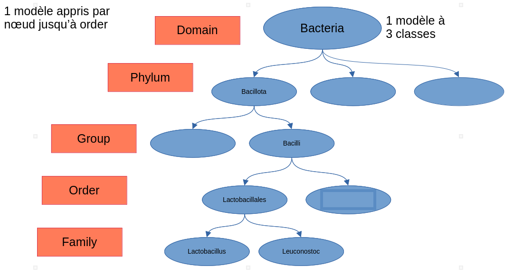
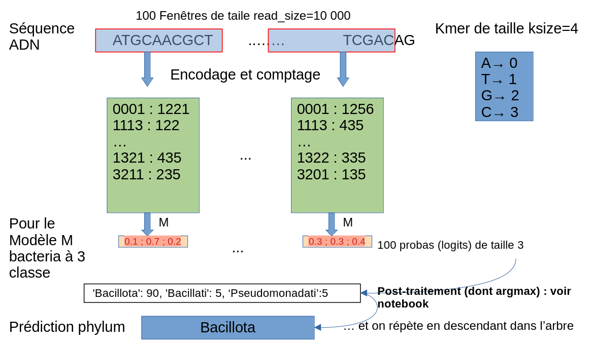

**projet**: microtaxo

**accompagnement PNRIA**: du 25 novembre 2024 au 25 mai 2025


**package wisp_light** sur données refseq: Hermann Courteille (PNRIA)

Ce Readme concerne essentiellement la partie administration du package: 
- la mise à jour de la base de donnée
- l'entrainement et la validation des modèles via xgboost
- le monitoring des résultats

Pour l'usage d'un modèle entrainé,  voir le notebooks/predict_taxo_examples.ipynb ou l'éxécutable tk_infer partie V


# I.  Environnement


## code wisp_light / branche optim_wisp
```
git clone https://github.com/dubssieg/wisp.git 
cd wisp
git checkout optim_wisp
```


## virtual env
sur genouest en python 3.11.9 , obligatoirement sur un noeud calcul
```
srun --time 00-10:00:00 --pty bash 
. /local/env/envpython-3.11.9.sh

python3.11 -m venv ~/envtaxo
source ~/envtaxo/bin/activate
pip install -r requirements.txt 
```

## conda
en python 3.12, spécifié dans le yml
```
conda env create -f micro_env.yml
conda activate micro_env
```
## installation de  wip_light 
en tant que paquet avec ses dépendances (fichier setup.py):

depuis le répertoire wisp
```
pip install -e .  
```

# II. Construire le dataset refseq 

## a. Télécharger et dézipper tous les fichiers listés dans le .tsv 
- obtenir le summary.txt 
```
wget https://ftp.ncbi.nlm.nih.gov/genomes/refseq/bacteria/assembly_summary.txt -P {output_dir}
```
ou via l'interface web 

`https://www.ncbi.nlm.nih.gov/datasets/genome/?taxon=2&reference_only=true`


- wisp_light/build_dataset/refseq/reference_genome_summary.tsv
**version refseq**:  Release 227 November 4, 2024.

à partir de ce fichier, nous allons télécharger les fichiers .fna puis récupérer les taxonomies

depuis /wisp_light/build_dataset/refseq
```
python download_refseq_from_csv.py --csv_file assembly_summary.txt \
    --output_dir /home/hcourtei/Projects/MicroTaxo/codes/data/refseq_data \
    --filter_by reference genome \
    --num_workers 8
```
ce script sauvegarde aussi la base de donnée filtrée dans un fichier  <filter_by>_summary.tsv avec les espaces remplacés par des underscores)
, par exemple reference_genome_summary.tsv
## b. Obtenir les taxonomies à partir des taxid de chaque génome 
Entrées du script : 
- Un fichier TSV d'entrée contenant une colonne de taxids.
- Un fichier `NCBI_api_key.yaml` à placer dans ce répertoire pour accélerer les requètes de 3 à 10 par seconde, voir https://support.nlm.nih.gov/kbArticle/?pn=KA-05317 :
```
Entrez:
    email: "votre_email@domaine.com"
    api_key: "votre_clé_ncbi"
```

```
python get_all_taxo_from_NCBI.py --input reference_genome_summary.tsv --taxid_column taxid --batch_size 10
```
toutes les informations taxonomiques sont mise en cache dans un répertoire `ncbi_taxonomy_cache`
2 tableaux tsv sont générés dans le répertoire  /wisp_light/build_dataset/refseq : 
- le 1er avec toutes les taxonomies présentes  ['phylum', 'class', 'order', 'family'] dans "reference_genome_summary_complete_taxo.tsv"
- le 2eme avec des taxonomies incompletes dans "reference_genome_summary_incomplete_taxo.tsv"

## c. Association dans l'itérateur
La classe RefSeqDataset permet d'itérer sur tous les génomes téléchargés dont la taxonomie a été récupére.
Elle permet la séparation en 2 ensemble : un ensemble d'entrainement et un ensemble de validation

```python
from wisp_light.dataset.refSeqDataset import RefSeqDataset
datadir = "/home/hcourtei/Projects/MicroTaxo/codes/data/refseq_data"
dataset = RefSeqDataset("reference_genome_summary_complete_taxo.tsv", datadir)
```

```
11:49 - refSeqDataset.py - INFO - nb files in datadir: 986 restrict to 907 with labels in index 
11:49 - refSeqDataset.py - INFO - Splitted dataset nb 907 into train :816 val: 91
 0, genome /home/hcourtei/Projects/MicroTaxo/codes/data/refseq_data/GCF_000740965.1_ASM74096v1_genomic.fna
taxo_dict {'phylum': 'Pseudomonadota', 'class': 'Gammaproteobacteria', 'order': 'Enterobacterales', 'family': 'Pectobacteriaceae'}
 1, genome /home/hcourtei/Projects/MicroTaxo/codes/data/refseq_data/GCF_020510245.1_ASM2051024v1_genomic.fna
taxo_dict {'phylum': 'Bacillota', 'class': 'Bacilli', 'order': 'Lactobacillales', 'family': 'Lactobacillaceae'}axellales', 'family': 'Moraxellaceae'}
```
# III. Entraîner et Evaluer les modèles xgboost
On part de tous les génomes de références de refseq.
Cette base est découpée en train/val avec la fonction sklearn.model_selection.train_test_split, la graine aléatoire est fixée
dans params.yaml afin de pouvoir assurer la reproductibilité.

L'entrainement et la validation se fait en 3 temps:
1. la construction d'une base de données regroupant tous les comptages de kmer sur le train
2. l'entrainement des modèles de façon hiérachique
3. la validation sur le jeu de validation

Tous les paramètres de pre-processing, de xgboost ... sont dans : `wisp_light/training/params.yaml`

Commande à partir de wisp_light/training/
- **en local** : 
```
 python train_val.py  \
  --exp_name test_laptop  \
  --datadir /home/hcourtei/Projects/MicroTaxo/codes/data/refseq_data \
  --params_file training/params.yaml
```
- **sur genouest**, 

les données sont sur /projects/microtaxo/data
```
.
├── AllTheBacteria
├── refseq_complete_genome
└── refseq_reference_genome
```

```
srun --time 00-10:00:00 --mem=20G --cpus-per-task=8 --pty bash #depuis genouest
```
```
source ~/envtaxo2/bin/activate
ou 
conda activate micro_env
```
depuis wisp_light/training
```
python train_val.py \
  --exp_name test_laptop  \
  --datadir /projects/microtaxo/data/refseq_reference_genome \
  --params_file training/params.yaml
  ```

Pour partir d'une base de donnée de comptage déjà existante:
 ```
python train_val.py --db_json  /home/genouest/cnrs_umr6074/hcourtei/codes/wisp/exp/model_base_02_05_16_55/databases.json
 ```


1. Session interactive avec srun (voir ci-dessus) :
Pour éviter une coupure de la connexion SSH, vous pouvez utiliser tmux sur GenOuest.
Voir  https://help.genouest.org/usage/slurm/#long-running-interactive-jobs-srun

2. Avec sbatch , ajuster  parameter in .sh , params.yaml or train_val.py, then 
`sbatch submit_main_build.sh`

# IV. Voir les résultats
## 1. Sorties issues d'une expérience
Les logs et résultats d'une expérience sont par défaut, au même niveau que wisp_light dans un répertoire exp/<exp_name>
Sur genouest ils ont été enregistré dans /projects/microtaxo/exp_refseq/
Voici le contenue d'une expérience
```
.
├── databases.json         # la base de donnée de comptage
├── eval                   # les metriques de validation
├── init_train.log         # les logs d'entrainement
├── model                  # contient tous les modèles entrainés, 
├── params.yaml            # tous les paramètres de l'entrainement
├── phylo_tree.bin         # l'arbre phylo sérialisé en binaire pour rechargement
└── phylo_tree.txt         # l'arbre phylogénétique pour affichage lisible
```
### arbre phylogénétique  
début d'un arbre dans  phylo_tree.txt
```
Root
├── Actinomycetota
│   ├── Actinomycetes
│   │   ├── Actinomycetales
│   │   │   └── Actinomycetaceae
│   │   ├── Bifidobacteriales
│   │   │   └── Bifidobacteriaceae
│   │   ├── Frankiales
│   │   │   └── Frankiaceae
│   │   ├── Kineosporiales
│   │   │   └── Kineosporiaceae
│   │   ├── Kitasatosporales
│   │   │   └── Streptomycetaceae
│   │   ├── Micrococcales
```
### model
regroupe tous les modèles entrainé pour chacune des noeuds internes de l'arbre. Chque modèle est enregistré dans un json
prénomé f"{taxon}_{level}.json" et accompagné d'un fichier de paramètres suffixé par "_params.json"
Exemple : 
```
 Chromatiales_order_params.json                      Mariprofundales_order_params.json         Tichowtungiia_class_params.json
 Chroococcales_order.json                            Mesoaciditogales_order.json               Tissierellales_order.json
 Chroococcales_order_params.json                     Mesoaciditogales_order_params.json        Tissierellales_order_params.js
```
### eval

dans le sous-répertoire eval: 
```
├── error_phylum_val.txt   # les génomes pour lesquelles il y a une erreur dès le phylum
├── metrics                # les matrices de confusion en image, et en csv avec le nom des taxons
│ ├── ConfMat_class.csv
│ ├── ConfMat_class.png
│ ├── ConfMat_family.csv
│ ├── ConfMat_family.png
│ ├── ConfMat_order.csv
│ ├── ConfMat_order.png
│ ├── ConfMat_phylum.csv
│ └── ConfMat_phylum.png
```
### en quelques chiffres sur genouest

A titre indicatif, sur la base des génomes référents (~20 000 génomes), l'entrainement pour des kmers de taille 4 (100 reads de taille 10 000 par génome), 
l'entrainement  sur genouest noeud cl1n027 prend:
- approximativement 6h 
- consomme moins de 40 Go de mémoire vive
- les modèles occupent 630 Mo d'espace disque (/projects/microtaxo/exp_refseq/model_base_complete_04_07_22_15/model )

## 2. Comparaison des  expériences avec mlflow

depuis un <noeud> de calcul  sur genouest:
```
tmux # pour avoir une session détachée
srun --pty --time=08:00:00 bash
. ~/envtaxo2/bin/activate


mlflow ui --port 8123 --backend-store-uri /projects/microtaxo/exp_refseq/mlruns
```
cliquer sur le lien fourni après avoir , faire un point ssh vers le <noeud> depuis votre laptop
```
ssh -A -t -t <user>@genossh.genouest.org -L 8123:localhost:8123 ssh <noeud> -L 8123:localhost:8123
```
# VI. Prédiction sur un fichier .fna ou un répertoire

Voici l'arbre et les différents niveaux hiérachique que l'on prédit :



Partant d'une séquence d'ADN, voici la partie encodage et comptage et ensuite l'illustration de la prédiction pour le premier niveau : le phylum





A chaque nouveau noeud, prédit, on répète le processus, jusqu'à arrivé à la famille. Sur l'exemple ci-dessus, la lignée est:

domain: Bacteria , phylum : Bacillota, group: Bacilli, Order : Lactobacillales, Family Lactobacillus 

=========================================================================================================

soit en commande python, voir notebooks/predict_taxo_examples.ipynb

Une interface simple de chargement du modèle et de prédiction est exécutable après l'installation du paquet wisp_light
```
pip install -e . # à partir du répertoire parent à wisp_light
```
puis en éxécutant dans la console
```
tk-infer
```


Les résultats des préditions sont affichés dynamiquement dans la fenêtre résultat à droite


ensuite cliquer sur le lien : 
# VI. Divers
## 1. Partitions avec accès disque plus rapide

srun --cpus-per-task=20 -p genscale -w cl1n027 --mem 40600 --pty bash

- cl1n026 (24 Xeon(R) CPU E5-2640 0 @ 2.50GHz)
- cl1n027 (40  Xeon(R) CPU E5-2660 v3 @ 2.60GHz)
- cl1n028 (40  Xeon(R) CPU E5-2660 v3 @ 2.60GHz)

le disque plus rapide est en local sous /WORKS.
Pour l'utiliser il faut mettre les données data/refseq_data dans ce répertoire

## 2. Test  conda env with glibc >1.28 
 
échange avec le support genouest

j'aimerais lancer xgboost en version gpu. J'ai une erreur car gllibc est < 2.28 . Or

Matéo Boudet ->
A priori pas possible de mettre à jour de notre coté tant qu'on n'a pas mis à jour les OS des noeuds de calcul (ca sera fait dans les mois à venir).
En attendant, vous pouvez essayer de vous créer un environnement conda avec glib pour avoir la version que vous voulez.
```
conda install -y gcc_linux-64 gxx_linux-64 -c conda-forge
pip install xgboost --no-binary :all:
```

```
. /local/env/envconda.sh
conda activate py311_env
source ~/.bashrc
```

```
export PATH=$CONDA_PREFIX/libexec/gcc/x86_64-conda-linux-gnu/14.2.0:$PATH
export CC=$CONDA_PREFIX/libexec/gcc/x86_64-conda-linux-gnu/14.2.0/gcc
export CXX=$CONDA_PREFIX/libexec/gcc/x86_64-conda-linux-gnu/14.2.0/g++
```
```
conda install -c nvidia cudatoolkit=11.8.0
```
for nvcc

```
export PATH=/usr/local/cuda-12.3/bin:$PATH
export LD_LIBRARY_PATH=/usr/local/cuda-12.3/lib64:$LD_LIBRARY_PATH
nvcc --version 
```
```
srun --time 00-01:00:00 --mem=20G --gpus 1 -p gpu --pty bash
```